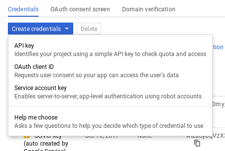
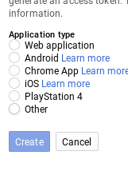
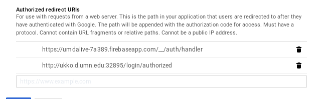

# UMD Alive v 1.0

A five-person project, the Bagel Bois branch and application of UMD Alive is an off-shoot of the main branch version that functions similarly to the original, but works logistically different. UMD Alive meant for the use on the University of Minnesota-Duluth campus, and is designed specifically in-mind to work on bringing club information to the forefront, and make it easy to join, create, and find clubs. It is a platform for all of the on-campus clubs and students so that everyone can find a fun group with similar interests to join.

The team for this project consisted of five computer science students from CS 4531: Devin Cheek, Dominic Cheek, Ross Schultz, Josh Senst, and Paul Sipper. Each member had their own responsibilities, but would help each other if needed. 

Devin Cheek's primary focus was on the main activity and transitioning everything into fragments.

Dominic Cheek was solely responsible for managing the server and all of its databases.

Ross Schultz worked on the user profile side of things.

Josh Senst added all functionality for the club and event pages, allowing the ability to join and create clubs/events.

Paul Sipper handled the page that displays all of the clubs as well the majority of the documentation.

# Install

1. Create Firebase App

   1. See https://github.umn.edu/CS4531/TechPrep/blob/master/README.md for generating google-services.json file.

      
2. Navigate to https://console.developers.google.com and select your project/create your project

   	

   

   In this multiple choice select **Web Application**

   

   Authorized redirects are necessary to tell OAuth how to communicate to the server.

   Most likely you will need to update this if you change ports often enough. But you can use what I have as a base for your application, ideally you would like something like this url: **http://ukko.d.umn.edu:PORT/login/authorized** and then a localhost URL for development such as **http://localhost:PORT/login/authorized**

3. To start the web application you will need to have **Python3** and **pip** installed on your system. See the section on **Using and Modifying the Web Application** for how to set that up.

   Once you have a virtual environment setup we need to setup yet another PORT for our flask server to run on. So now we should have:

   1. Mongo port in **mongod.conf**
   2. Rest API port in **index.js**
   3. Flask port in **runserver.py**

   All three of these should be separate ports. Node will only need to know about the mongo port in **databaseFunctions.js**. **Flask** needs to know what port the **Node** server is running on. You can specify the **Node** server address in **umdAliveWebApp/umdAliveWebApp/views.py**.

# Files and Functionality

This project utilizes a main activity, fragments, singletons, and volley calls to a noSQL database to present club, event, and profile information in a logical manner. Google OAuth is used to handle the login process, which also adds a name and profile image for each user.

The app is separated as follows:

 - Main
	 - Main Activity
		 - This file is the framework for all of the fragments. It includes the basic navigation, handles the Google Sign-in, and loads all fragments.
	 - RestSingleton
		 - Synchronizes all requests across the app.
	 - UserSingleton
		 - Synchronizes the user, allowing for their data to be stored and accessed by other users of the app.
 - Base
	 - AllClubsFrag
		 - Generates a scrolling list that shows all of the club names stored in the database. Clicking on a name will bring the user to the club's page.
	 - ClubFrag
		 - Shows a view of relevant information about a club, such as its name, description, members, admin, and events. Clicking on a member or event will change the page to the relevant one. If a member is an admin, the ability to edit the club page appears, as well as the ability to add an event, and clicking the edit club brings the user to the edit club page, while clicking add event, brings the user to the edit event page.
	 - EventFrag
		 - A page that displays the title, date, and time of an event.
	 - ProfileFrag
		 - Displays after sign-in, it shows the users Google Account image and name, as well as an about me section, which includes their major and minor. There is a button that allows the ability to edit the about me section.
 - Edit
	 - EditClubFrag
		 - Page only accessible to admins, allows the editing of the club page.
	 - EditEventFrag
		 - Page only accessible to admins, allows editing of events.
	 - EditProfileFrag
		 - Page accessible to all users, allows editing of that users profile.
 - Create
	 - CreateClubFrag
		 - Pages accessible to all users, allows creation of a club. The user that creates the club will then become the club's admin.
	 - CreateEventFrag
		 - Page accessible to admins, allows the creation of an event for a club.
	 - CreateUserFrag
		 - First-time login only, allows creation of the user profile, with ability to edit an about me section.


## Server and Database

The application's information is stored in a MongoDB hosted on UMD's own ukko server. Inside of the database, there are three separate collections: Users, Clubs, and Events. All collections store relevant data as JSONObjects, which are accessed by the application with asynchronous volley calls. 

Inside the database, there numerous queries: createClub, editClub, getClub, getAllClubs, joinClub, leaveClub, deleteClub, createUser, editUser, getUser, deleteUser, createEvent, editEvent, and getEvent. All are necessary to perform actions within the app itself.

## Getting Started
UMD Alive should be able to run on most Android devices, as long as they are running Android Ice Cream Sandwich 4.0.3.

**Google OAuth Steps**

Since the project utilizes Google OAuth, you must follow these steps to get the project working:

1. Head to this link: https://developers.google.com/identity/sign-in/android/start-integrating
2. Follows steps in the configuration of a Google API Console Project

## Prerequisites and Installation

**Software Information:**

 - Android Studio Version last tested to work: 3.1
 - Minimum Android SDK Version: 15+ (minimum Ice Cream Sandwich 4.0.3)
 - Target SDK Version: 27
 - Compile SDK Version: 27
 - Utilizes Google OAuth API for login

 To run this application, you must connect to an instance of the node server with the MongoDB. The url must be changed in the application if you are not running with the original server.

## Web Client Instillation 

Current State of Project
-------------

**Streamline** 

 The streamline was implemented using a RecyclerView holding CardViews. The RecyclerView acts as a flexible list of all events that have been posted(in the form of cards). It implements a view holder which contains a card containing the event title, posting club’s name, event date and time, location, description, and an image. The RecyclerView works nicely in this context because it allows for new posts to be easily added to the the streamline. 

**Post for Club**

Directly related to the streamline feature, a key feature for the app is the ability to create a post about an event for your club. Posts appear on the streamline of recent/upcoming events. Each post has an image header selected by the poster,  event name, date, time, and location. These all appear on every event posted in the streamline. If the user wishes to see additional information or an extended description, they can tap the post to expand the information.

**User Profile**

Generated from Google Login. A profile picture, name, and email address is accessed from Google. An option to add your Major and Graduation Date is also available. 

**Create A Club**

User can make a new club with a club name, admin user, description, and a keyword tag.

**Search For Club**

After an interest profile was collected by the CUE group, they gave us a list of key terms that students had suggested as possible interest groupings for clubs. Some of the keywords suggested were academic, food, free, religion, sports, outdoors, and music. A spinner is used to select which keyword they would like to search for clubs. The list of clubs with their accompanying key terms are stored as an array of strings. 

**Login**

In order to login to the app using a UMD ID/password, we implemented the Google OAuth API. By implementing this, it uses Google authentication and authorization to log in. After obtaining credentials from the Google API console, an access token is granted from the Google Authorization Server and then the token can be refreshed if necessary. Since the UMD login is hosted through Google, the Google OAuth login can be used for student accounts. The API also has features to return dname, email, and user picture.

There is currently no options for deleting anything. This should be one of the first things to proceed with.

**Data Management**

All data is stored on a MongoDB which is managed by a node.js server. File names are index.js and mongoDBFunctions.js found in umdAliveServer folder.

Unit Testing Included
---------------------

Jenna Anderson: ClubInformationUnitTest; creates a test club and checks to see that all the data is created and stored properly. 

Ryan Gebhart: PostInformationModel; Test checks proper initialization of Posts. It compares different posts checking for inequality.
    JSONStringify() is not tested due to this error: java.lang.RuntimeException: Method put in org.json.JSONObject not mocked.

Wesley Osumo: NodeServer; The test checks several Get and Put Rquests. an initial querry is done to the server to get the current stack, then several put requests are sent to the server. The server then is requested to return the current stack once more.  Current club and the position methods are not tested due to incompletes in the project infrauscture.

Andy Miller: Presenter; Created a thorough unit test for all functionality.
    There are issues with using AsyncTask in unit tests so it makes many of the tests worthless. I will look into it more to see if there's a good way to work around that.

**Google Auth** 
https://developers.google.com/android/guides/client-auth

setup of auth, followed stackoverflow here: https://stackoverflow.com/questions/34367870/where-do-i-get-a-google-services-json


Using and Modifying the Web Application
----------------------------------------
### Prerequisites
### Linux
Install the latest python3 and virtual environment.
You do not need virtualenv on your presonal machine but if you want to run this web app on Ukko you need to run virtualenv
```
apt-get install python3
apt-get install python3-pip
apt-get install virtualenv
```
Set up a virtualenv, env is the environment name. You can change this to whatever you want.
```
bash
virtualenv python3 env
. env\bin\activate
```
Now you can run the runserver.py. Note you do not need to type python3 because when you created the environment from the above code it sets the python environment to python3. Pip install -r loads a text file of all the modules needed to install. Pip is pythons package manager. Similar to apt-get on debian/linux. 
```
pip install -r requirments.txt
python runserver.py
```

### windows
https://www.python.org/downloads/windows/

This project includes a .sln file, visual studio project file, that you can run with visual studio community edition. 

## Built With

* [Flask](http://flask.pocoo.org/) - The web framework used
* [Bootstrap4](https://getbootstrap.com/docs/4.0/getting-started/introduction/) - Bootstrap is a free and open-source front-end library for designing websites and web applications.
* [FullCalendar](https://fullcalendar.io/) - OpenSource Javascript Calendar
* [Google API](https://developers.google.com/api-client-library/python/guide/aaa_oauth/) - Used to generate login tokens

## Tools we used
Linux Developers:
* [VS Code](https://code.visualstudio.com/) - Visual Studio Code is a source code editor

Windows Developers: 
* [Visual Studio Community](https://www.visualstudio.com/vs/community/) - Free edition of Visual Studio IDE

   All of the software that pertains to the web application can be found in the UMDAliveWebApp folder. Most of the heavy lifting
   is done by a Flask application, which is a python framework. To start the server, run the python file labeled “runserver.py”. That file is set
   up to run on a hosted server, but you can switch the boolean value “serverUse” to false for debugging on port 5555 of localhost. All of the
   mongoDB and REST API details are in views.py, which acts as providing the backend-data, which is then sent to our HTML files for each page,
   which uses Javascript to deal with much of the cleaning up and displaying.

   BE WARNED AND HARKEN. You will see magical methods that will make no sense and miraculously work. These methods are heavily documented
   and it is advised that you thoroughly understand what is happening before you change any of the magic. We also added methods to the REST API
   to add ease of use when handling the requests through Flask. If you are completely lost, you may email one of the developers at  bran0847@d.umn.edu or karls071@d.umn.edu
   and I will attempt to get back to you in a timely manner. For the rest, I leave up to you. Good luck and godspeed, mon frère.

## Authors of WebApp

* **Brandon Geraci** - *Initial work* - [bran0847](https://github.umn.edu/bran0847)
* **Adam Karlstedt** - *Initial work* - [karl071](https://github.umn.edu/karl071@d.umn.edu)

# Note for future development

* Webapp and Server code have not been merged. This is something that will have to be done by hand to update everything to an inclusive format.
* This app utilizes OAUTH
  * To integrate with the app you can follow these instructions.

## License
GNU General Public License v3.0

Google Auth https://developers.google.com/android/guides/client-auth


